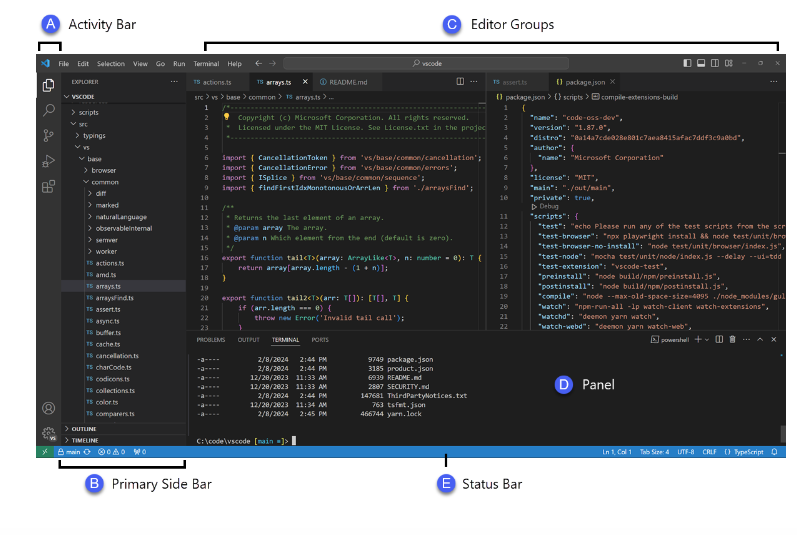
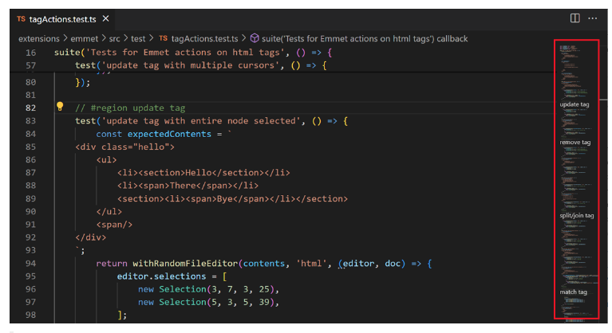
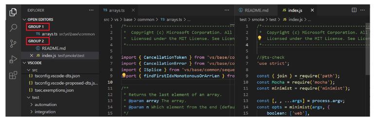
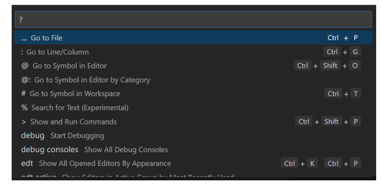

# SE-Assignment-5
Installation and Navigation of Visual Studio Code (VS Code)
 Instructions:
Answer the following questions based on your understanding of the installation and navigation of Visual Studio Code (VS Code). Provide detailed explanations and examples where appropriate.

 Questions:

1. Installation of VS Code:
   - Describe the steps to download and install Visual Studio Code on Windows 11 operating system. Include any prerequisites that might be needed.

   Open a web browser and go to code.visualstudio.com.
Choose and download the version for your operating system. Visual Studio Code supports Windows, Linux, and macOS. Once downloaded, double click on the app icon and run the installer.

Click on your installer to start installing.

Once the installer launches, step through the installation process. First, accept the License Agreement, then click "I accept the agreement".

Accept the default location for installation by clicking "Next".

Accept the default Start Menu folder name by clicking "Next".

Confirm the installation options, then click "Install"

The installation will proceed.

Click Finish to exit the installation and (by default) launch Visual Studio Code:

The Visual Studio Code installer will create an icon in the ⊞ Start Menu. To locate it, click on the Start Menu and search for 'Code':

Visual Studio Code will launch.

3. Set Up Version Control System:
   Install Git and configure it on your local machine. Create a GitHub account for hosting your repositories. Initialize a Git repository for your project and make your first commit. https://github.com

INSTALLATION & GUIS
With platform-specific installers for Git, GitHub offers a graphical user interface for daily engagement, review, and repository synchronization in addition to making it simple to keep current with the most recent iterations of the command line tool.

GitHub for Windows
htps://windows.github.com

Open Command Propmpt on the windows button/ applications and run the Command Propmt as an Administrator.

Configuring user information used across all local repositories
git config --global user.name “[firstname lastname]”
set a name that is identifiable for credit when review version history
git config --global user.email “[valid-email]”
set an email address that will be associated with each history marker
git config --global color.ui auto

SETUP & INIT
Configuring user information, initializing and cloning repositories
git init
initialize an existing directory as a Git repository
git clone [url]
retrieve an entire repository from a hosted location via URL

4. Install Necessary Programming Languages and Runtimes:
  Instal Python from http://wwww.python.org programming language required for your project and install their respective compilers, interpreters, or runtimes. Ensure you have the necessary tools to build and execute your code.

Download the Python Installer
Go to the official website of Python – Python download page for Windows.

Click on the latest version of Python for Windows. Click the appropriate link for your system to download the executable file: Windows installer (64-bit) or Windows installer (32-bit).

After the installer is downloaded, double-click the .exe file, for example, “python-3.11.2-amd64 .exe“, to run the Python installer.

If you want to save the installation file in a different location, click on Customize installation; otherwise, continue with Install Now.

Once the installation is complete, the pop-up box will appear, "Setup was successful". Click "Close" to end the setup.

5. Install Package Managers:
   If applicable, install package managers like pip (Python).

   Open bash interface and run it as an administrator.

   Type "$ python --version" and press enter to make sure the latest python is installed.

   if the latest python is installed, type "python get-pip.py." and press enter.
    
    

To test whether the installation was successful, type "python -m pip help"

2. First-time Setup:
   - After installing VS Code, what initial configurations and settings should be adjusted for an optimal coding environment? Mention any important settings or extensions.

Choose the "Visual Studio" workload during installation, which includes the necessary components for general development.

Select Workloads and Components, In the Visual Studio Installer, select the workloads and components you need based on your development requirements. Common workloads include ".NET Desktop Development" or "Web Development."

Modify Installation (Optional), If needed, you can customize the installation by clicking on the "Individual components" tab in the installer and selecting or deselecting specific components.

Install, Click the "Install" button to start the installation process.

This may take some time, as it involves downloading and installing the selected components.

Launch Visual Studio, Once the installation is complete, launch Visual Studio.

Sign in with your Microsoft account or create one if prompted.

Choose Development Environment: On the welcome screen, select your development environment. For example, you can choose "Development Settings" based on your preferred coding style.

Extensions: Click on extension button, on the search bar search python plugin and install: providing access points for extensions to seamlessly integrate and offer support for IntelliSense (Pylance), debugging (Python Debugger), formatting, linting, code navigation, refactoring, variable explorer, test explorer, and more.

search for pylance and install: Pylance is an extension that works alongside Python in Visual Studio Code to provide performant language support. 

search for python debbuger and install: Python Debugger provides a seamless debugging experience by allowing you to set breakpoints, step through code, inspect variables, and perform other essential debugging tasks.

search for prettier code and install: Prettier code enforces a consistent style by parsing your code and re-printing it with its own rules that take the maximum line length into account, wrapping code when necessary.
 
search for code runner and install: Run code snippet or code file for multiple languages: C, C++, Java, JavaScript, PHP, Python, Perl, Perl 6, Ruby, Go, Lua, Groovy, PowerShell, BAT/CMD, BASH/SH, F# Script, F# (.NET Core), C# Script, C# (.NET Core), VBScript, TypeScript and many other languages.

Search for Dart Code: It extends VS Code with support for the Dart programming language, and provides tools for effectively editing, refactoring, running, and reloading Flutter mobile apps.

Search for Flutter: This VS Code extension adds support for effectively editing, refactoring, running, and reloading Flutter mobile apps. It depends on (and will automatically install) the Dart extension for support for the Dart programming language.

3. User Interface Overview:
   - Explain the main components of the VS Code user interface. Identify and describe the purpose of the Activity Bar, Side Bar, Editor Group, and Status Bar.

VS Code adopts a common user interface and layout of an explorer on the left, showing all of the files and folders you have access to, and an editor on the right, showing the content of the files you have opened.

A. Activity Bar - Located on the far left-hand side. Lets you switch between views and gives you additional context-specific indicators, like the number of outgoing changes when Git is enabled. You can change the position of the Activity Bar.

B. Primary Side Bar - Contains different views like the Explorer to assist you while working on your project.

C. Editor - The main area to edit your files. You can open as many editors as you like side by side vertically and horizontally.

D. Panel - An additional space for views below the editor region. By default, it contains output, debug information, errors and warnings, and an integrated terminal. The Panel can also be moved to the left or right for more vertical space.

E. Status Bar - Information about the opened project and the files you edit.

F. Minimap: A Minimap (code outline) gives you a high-level overview of your source code, which is useful for quick navigation and code understanding. A file's minimap is shown on the right side of the editor. You can select or drag the shaded area to quickly jump to different sections in your file.

F. Editor Groups: When you split an editor (using the Split Editor or Open to the Side commands), a new editor region (edit group) is created which can hold a group of items. You can open as many editor groups as you like side by side vertically and horizontally.

G. Breadcrumbs: The editor has a navigation bar at the top, also called breadcrumbs. Breadcrumbs always show the file path and, if the current file type has language support for symbols, the symbol path up to the cursor position. 

4. Command Palette:
   - What is the Command Palette in VS Code, and how can it be accessed? Provide examples of common tasks that can be performed using the Command Palette.

Command Palette: The Command Palette provides access to many commands. You can run editor commands, open files, search for symbols, and see a quick outline of a file, all using the same interactive window.

VS Code command palette is equally accessible from the keyboard. The most important key combination to know is command + P (Mac), which brings up the Command Palette. From here, you have access to all functionality within VS Code, including keyboard shortcuts for the most common operations.

5. Extensions in VS Code:
   - Discuss the role of extensions in VS Code. How can users find, install, and manage extensions? Provide examples of essential extensions for web development.

   Extensions: Click on extension button, on the search bar search python plugin and install: providing access points for extensions to seamlessly integrate and offer support for IntelliSense (Pylance), debugging (Python Debugger), formatting, linting, code navigation, refactoring, variable explorer, test explorer, and more.

search for pylance and install: Pylance is an extension that works alongside Python in Visual Studio Code to provide performant language support. 

search for python debbuger and install: Python Debugger provides a seamless debugging experience by allowing you to set breakpoints, step through code, inspect variables, and perform other essential debugging tasks.

search for prettier code and install: Prettier code enforces a consistent style by parsing your code and re-printing it with its own rules that take the maximum line length into account, wrapping code when necessary.
 
search for code runner and install: Run code snippet or code file for multiple languages: C, C++, Java, JavaScript, PHP, Python, Perl, Perl 6, Ruby, Go, Lua, Groovy, PowerShell, BAT/CMD, BASH/SH, F# Script, F# (.NET Core), C# Script, C# (.NET Core), VBScript, TypeScript and many other languages.

Search for Dart Code: It extends VS Code with support for the Dart programming language, and provides tools for effectively editing, refactoring, running, and reloading Flutter mobile apps.

Search for Flutter: This VS Code extension adds support for effectively editing, refactoring, running, and reloading Flutter mobile apps. It depends on (and will automatically install) the Dart extension for support for the Dart programming language.

6. Integrated Terminal:
   - Describe how to open and use the integrated terminal in VS Code. What are the advantages of using the integrated terminal compared to an external terminal?

7. File and Folder Management:
   - Explain how to create, open, and manage files and folders in VS Code. How can users navigate between different files and directories efficiently?

Terminal provides integration with the editor to support features like links and error detection. The integrated terminal can run commands such as mkdir and git just like a standalone terminal.

You can open a terminal as follows:
From the menu, use the Terminal > New Terminal or View > Terminal menu commands.
From the Command Palette (⇧⌘P), use the View: Toggle Terminal command.
In the Explorer, you can use the Open in Integrated Terminal context menu command to open a new terminal from a folder.
To toggle the terminal panel, use the ⌃` keyboard shortcut.
To create a new terminal, use the ⌃⇧` keyboard shortcut.

8. Settings and Preferences:
   - Where can users find and customize settings in VS Code? Provide examples of how to change the theme, font size, and keybindings.

You can access the Preferences and Settings from the menu, select code, then preferences and then select settings.Or type command + , (Mac).

You can access the Preferences and Settings from the menu, select code, then preferences and then choose settings, from the menu you can change the Font size.

You can access the Preferences and Settings from the menu, select code, choose preferences then themes, the dropdown list will appear to change the theme. 

You can access the Preferences and Settings from the menu, select code, choose preferences then key shortcuts or press (command + K / command + S).

9. Debugging in VS Code:
   - Outline the steps to set up and start debugging a simple program in VS Code. What are some key debugging features available in VS Code?

Select Run and Debug on the Debug start view or press F5 and VS Code will try to run your currently active file. However, for most debugging scenarios, creating a launch configuration file is beneficial because it allows you to configure and save debugging setup details.

In order to start a debug session, first select the configuration named Launch Program using the Configuration dropdown in the Run and Debug view. Once you have your launch configuration set, start your debug session with F5.

Alternatively, you can run your configuration through the Command Palette (⇧⌘P) by filtering on Debug: Select and Start Debugging or typing 'debug ' and selecting the configuration you want to debug.

In addition, the debug status appears in the Status Bar showing the active debug configuration. By selecting the debug status, a user can change the active launch configuration and start debugging without needing to open the Run and Debug view.

Continue / Pause: F5	Continue: Resume normal program/script execution (up to the next breakpoint).
Pause: Inspect code executing at the current line and debug line-by-line.
Step Over: F10	Execute the next method as a single command without inspecting or following its component steps.
Step Into: F11	Enter the next method to follow its execution line-by-line.
Step Out: ⇧F11	When inside a method or subroutine, return to the earlier execution context by completing remaining lines of the current method as though it were a single command.
Restart: ⇧⌘F5	Terminate the current program execution and start debugging again using the current run configuration.
Stop: ⇧F5	Terminate the current program execution.

10. Using Source Control:
    - How can users integrate Git with VS Code for version control? Describe the process of initializing a repository, making commits, and pushing changes to GitHub.

Your workspace is on your local machine, you can enable Git source control by creating a Git repository with the Initialize Repository command. When VS Code doesn't detect an existing Git repository, the Source Control view will give you the options to Initialize Repository or Publish to GitHub.

Initialize Repository and Publish to GitHub commands from the Command Palette command + P (⇧⌘P). Running Initialize Repository will create the necessary Git repository metadata files and show your workspace files as untracked changes ready to be staged. Publish to GitHub will directly publish your workspace folder to a GitHub repository, allowing you to choose between private and public repositories.

When you launch VS Code from the command line, you can pass the --wait argument to make the launch command wait until you have closed the new VS Code instance. This can be useful when you configure VS Code as your Git external editor so Git will wait until you close the launched VS Code instance.

macOS: Select Shell Command: Install 'Code' command in path from the Command Palette.

From the command line, run git config --global core.editor "code --wait"

Now you can run git config --global -e and use VS Code as editor for configuring Git.

Some examples of where you can use VS Code as the editor:

git rebase HEAD~3 -i do interactive rebase using VS Code
git commit use VS Code for the commit message
git add -p followed by e for interactive add
git difftool <commit>^ <commit> use VS Code as the diff editor for changes

 Submission Guidelines:
- Your answers should be well-structured, concise, and to the point.
- Provide screenshots or step-by-step instructions where applicable.
- Cite any references or sources you use in your answers.
- Submit your completed assignment by 1st July 

